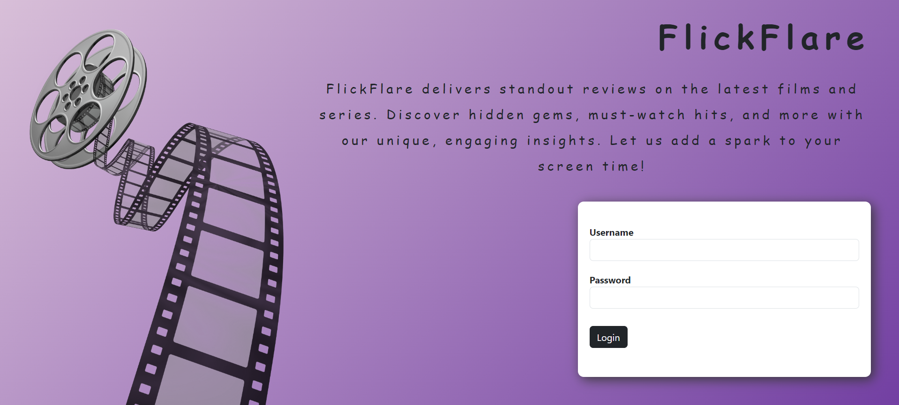
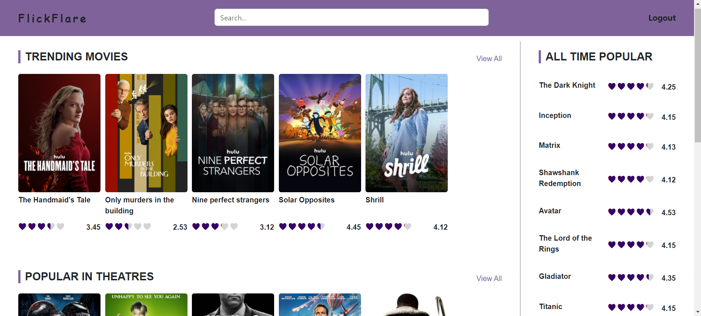
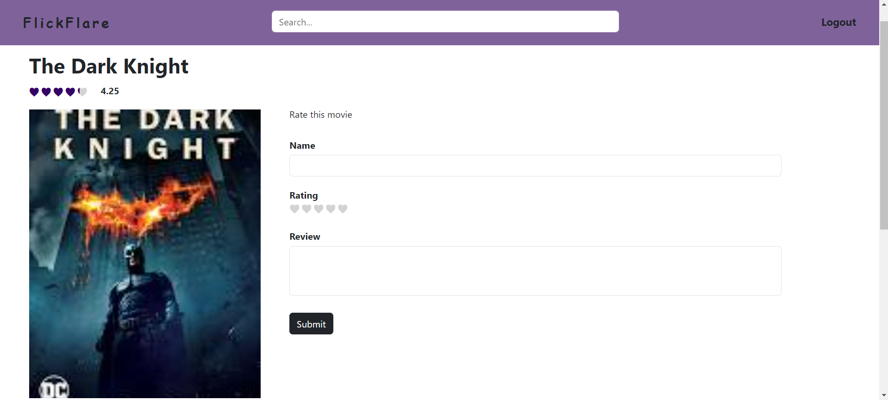
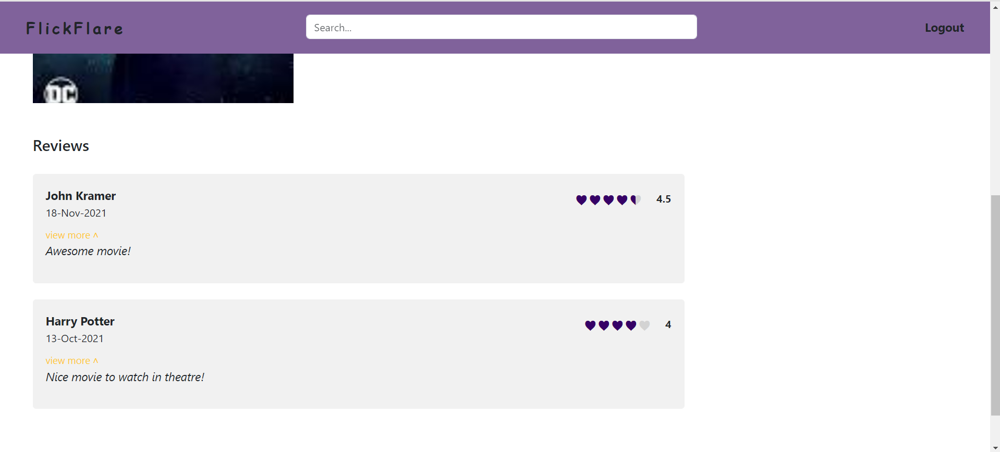

# FlickFlare

FlickFlare is a user-friendly Angular-based application designed for film enthusiasts to share and discover movie reviews. This frontend project allows users to submit their reviews, browse existing ones, and interact with a dynamic interface. Developed with Angular, FlickFlare highlights essential features of the framework and provides a seamless experience for movie review management.

***

> Table of Contents
1. Overview
2. Installation
3. Usage
4. Screenshots
5. Technologies Used
6. Contributing
7. Contact

***

## Overview
FlickFlare provides a platform for users to share and read reviews about movies. The application includes features such as review submission, viewing reviews, and browsing film information. It is built with Angular to demonstrate the framework's capabilities in creating dynamic and interactive web applications.

## Installation
To set up the project locally, follow these steps:

  1. Clone the Repository:
  ```
  git clone https://github.com/AkramNsir/Flickflare.git
  ```

  2. Navigate to the Project Directory:
  ```
  cd Flickflare
  ```

  3. Install Dependencies:
  Ensure you have Node.js installed. Then run:
  ```
  npm install
  ```

  4. Run the Application:
  ```
  ng serve
  ```
  Open your browser and navigate to http://localhost:4200 to view the application.

## Usage
Once the application is running, first you will get a login page:    
  * use these credentials:   
    - username: "test"    
    - password: "123456"   
  they are just hardcoded in [auth.service.ts](src/app/services/auth.service.ts) , you can adjust them as you like. Once you have a backend get rid of them and use your authentification api.        

  After that you can:
  * Submit a Review: Use the form to add your movie review.     
  * View Reviews: Browse through submitted reviews on the each movie page.    
  * Search Films: Use the search functionality to find specific movies.    

  note: data is stored in local storage, there is no backend to persist data this is just a front-end project.      

## Screenshots 
Here are some screenshots of FlickFlare project:

### Login Page


### Home Overview


### Movie Overview



## Technologies Used
<div style="display: flex; gap: 20px; flex-wrap: wrap;">

* <div style="background-color:blue;color:white;border-radius:5px;padding:10px;margin:5px;">
     Angular
  </div>

* <div style="background-color:#ffffff;color:#000000;border-radius:5px;padding:10px;margin:5px;">
     TypeScript
  </div>

* <div style="background-color:#47A248;color:white;border-radius:5px;padding:10px;margin:5px;">
     
     HTML/SCSS
  </div>

</div>

## Contributing
Contributions to FlickFlare are welcome! To contribute:

  1. Fork the repository.
  2. Create a new branch 

  ```
  git checkout -b feature-branch
  ```
  3. Make your changes.
  4. Commit your changes

  ```
  git commit -am "Add new feature"
  ```
  5. Push to the branch
  ```
  git push origin feature-branch
  ```
  6. Create a new Pull Request.

## Contact
For any inquiries or issues, feel free to reach out:

Name: Mohamed Akram Nsir    
Email: akramnsir5@gamil.com    
GitHub: https://github.com/AkramNsir
